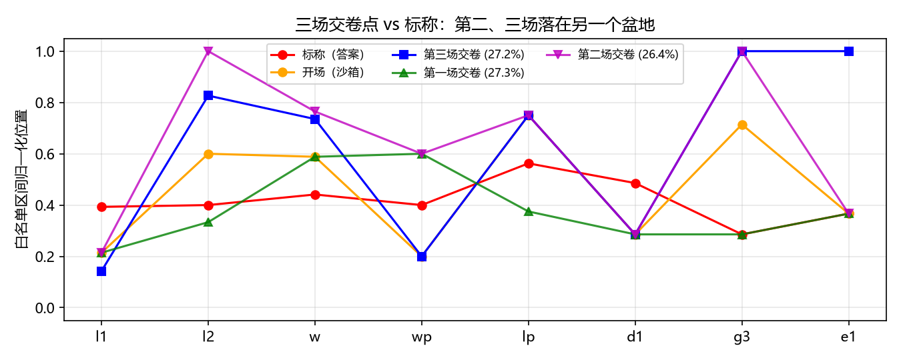
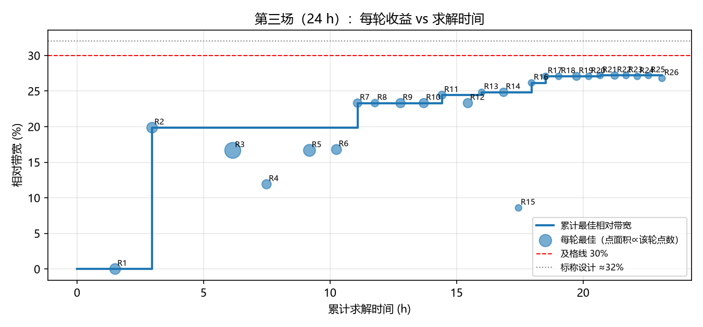
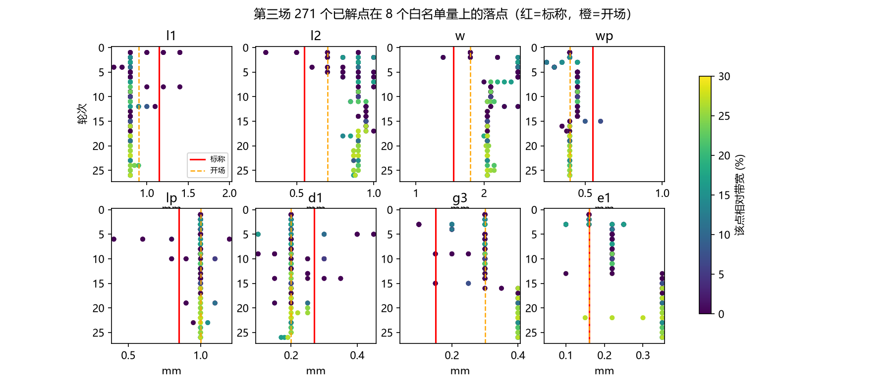
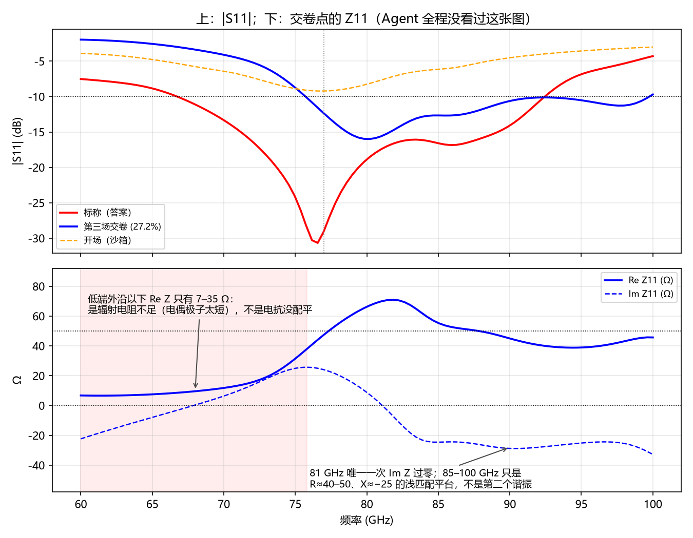

# 复盘：me_dipole_77 第三场（2026-08-30，24 h 求解预算）为什么 26 轮扫参还是没过

- 对象：`eval/exams/me_dipole_77/runs/20260830-141643`（Pi 会话 `2026-08-30T06-15-48` + 续跑 `2026-08-30T15-54-16`）
- 结果：77 GHz 处 −12.32 dB（达标）；相对带宽 27.19%（目标 > 30%，未达标）；solve_total 23h07m18s
- 分析材料：本场 26 轮的 `round-00N-table.csv` / `round-00N-s11.csv`、Pi 会话 JSONL 里的全部工具调用与思考、第一/二场归档日志、当前仍开着的 sandbox（我用 `snapshot` / `optimetrics_list` / `report_create(terminal_z)` 做了只读级别的试用）
- 立场：这里分析的每一个问题都是**手续层和工具层**的，不是这副天线特有的。改法也按「对任何天线都成立」来写。凡是只对 ME 偶极子成立的观察，都单独标出来，只作证据用。

## 0. 一句话结论

Agent 不是「算得不够久」，而是**在第 2 轮就走进了另一个盆地，之后 22 小时都在那个盆地里做越来越细的局部搜索**。R2 结束时（3 h）已经 19.9%，之后 20 h 只把最优值推到 27.2%：其中 R3–R6 的 7.3 h 增益为零，最后 4.4 h（9 轮）只换来 0.1 个百分点。它没有任何机制能发现自己走错盆地，也没有任何机制迫使它跳出去。第一场用 3 h 拿到 27.25%、落在标称盆地；第三场用 23 h 拿到 27.2%、落在另一个盆地——时间没有换来任何东西。

根因排序（按通用性）：

1. **手续本身是逐块贪心下降**：切一刀（2 维矩阵）→ 钉最好点 → 换一刀。8 维、多峰、上下文相关的地形里，第一刀切在错误的上下文里就决定了盆地，之后每一刀都在确认那个错误。
2. **只看 |S11|，不看阻抗**：模式身份靠猜、猜反了、然后按猜反的方向调了 20 轮。`terminal_z` 工具一直在，五场考试 0 次调用。
3. **「看一簇曲线」这一步实际上没有发生**：Skill 的画图脚本出 SVG，Agent 的 `read` 读不了 SVG，于是每轮都退化成 4 个标量（min、f_min、band、FBW）。续跑会话 17 小时只看了 4 张图。
4. **预算没有分阶段，也没有逃逸机制**：「没达标不准停」+「写不出结构理由就别开扫」两条规则冲突时，Agent 选择了用 6 点微扫填时间，并且在思考里明确写着「这是噪声采样，不是结构假设」。
5. **约束推理把搜索关进笼子**：槽约束 `ws = wp + g3 ≤ l1`，l1 被钉在 0.8 后馈电就被封死在 ≤ 0.8；反向的「放大 l1 能解锁馈电」从未被想到。
6. **状态与记忆脆弱**：会话在第 5 轮崩溃，续跑只靠日志重建；日志只写结论不写上下文向量；把探针残留当成「标称值」；job 句柄丢失；R4 组合表没存。

## 1. 数据

### 1.1 三场对照

| 场次 | 求解时间 | 轮数 / 点数 | 交卷点 (l1, l2, w, wp, lp, d1, g3, e1) | −10 dB 频段 | FBW | 与标称的归一化 L∞ 距离 |
|---|---|---|---|---|---|---|
| 标称（答案） | — | — | 1.15, 0.55, 1.55, 0.55, 0.85, 0.27, 0.15, 0.16 | 66.9–92.3 | **32.0%** | 0 |
| 开场（沙箱） | — | — | 0.9, 0.7, 1.8, 0.4, 1.0, 0.2, 0.3, 0.16 | 无 | 0% | 0.43 |
| 第一场 08-21 | 3h04m | 2 / 36 | 0.9, 0.5, 1.8, 0.7, 0.7, 0.2, 0.15, 0.16 | 64.0–84.2 | 27.25% | 0.20 |
| 第二场 08-22 | 8h07m | 3 / 112 | 0.9, 1.0, 2.1, 0.7, 1.0, 0.2, 0.4, 0.16 | 70.5–91.9 | 26.4% | 0.71 |
| **第三场 08-30** | **23h07m** | **26 / 271** | 0.8, 0.87, 2.05, 0.4, 1.0, 0.2, 0.4, 0.35 | 75.8–99.6 | **27.2%** | **0.71** |

第一场时的门槛是 25%，按当时规则通过；按现在的 30% 也不过。L∞ 距离 = 8 个量里离标称最远的那个，按白名单区间归一化。第二、三场的交卷点在 l2、w、g3、e1 四个轴上都压在或接近白名单边界，而且两场互相独立地落到了几乎同一个地方——那是一个真实存在的局部最优（~27%），不是随机噪声。

### 1.2 第三场每轮收益 vs 时间

| 阶段 | 轮次 | 求解时间 | 累计最优 FBW 变化 | 备注 |
|---|---|---|---|---|
| 开局 | R1–R2 | 3.0 h | 0 → 19.9% | R2 就锁定了 l1=0.8 / l2≈0.9 |
| 平台一 | R3–R6 | 7.3 h | 19.9 → 19.9%（**0 增益**） | R3 36 点 3h11m，其中 e1 一轴 4 个水平「几乎不敏感」→ 这 3 小时的 3/4 白花 |
| 找到高模 | R7–R12 | 5.1 h | 19.9 → 24.4% | 靠复扫 R2 的历史 CSV 发现 w=2.2 的双坑 |
| 平台二 | R13–R16 | 2.6 h | 24.4 → 26.1% | 全是 6–10 点微扫 |
| 平台三 | R17–R26 | 5.1 h | 26.1 → 27.2%，其中 **R18–R26 9 轮 4.4 h 只涨 0.1 pp** | 轴跨度 0.02–0.05 mm，白名单区间的 2–7% |

### 1.3 271 个点在 8 个轴上的落点

从会话 JSONL 里的 `variables_set` 顺序重建每一轮的上下文（非扫描量的钉值），再把 271 个点还原成完整 8 维向量后统计：

- **没有一个点**在全部 8 个轴上都落在标称 ±35% 区间内；离标称最近的点（L∞ 0.43）出现在 **R1**，之后再没有更近过——搜索一直在远离答案。
- l1 ≥ 1.0 的点共 24 个，全部处于 g3 ≥ 0.3、lp = 1.0、wp ≥ 0.4 的上下文（沙箱馈电或 Agent 钉死的强馈电）。**l1 ≥ 1.0 与 g3 ≤ 0.2 的组合：0 个点；与 lp ≤ 0.9 的组合：0 个点。** 标称是 l1=1.15、g3=0.15、lp=0.85。
- w ≤ 1.6 的点 4 个（都在 R2，l1=0.8 上下文）；标称 w=1.55。
- Agent 对 l1 的结论「l1=0.8 三次确认」（R1、R4、R8、R12、R24），五次全部在同一个盆地里做的。

## 2. 根因

### 2.1 手续是逐块贪心下降，第一刀决定盆地

Skill 第 5 步原文：「敏感的留下，不敏感的可以钉死。下一轮换一组，或同一组收窄加密。」这是 block-coordinate descent。它对「其它量已经大致正确、只剩一两个量要修」的问题有效；对「7 个量同时被扰动」的沙箱无效，因为每一张 2 维切片都是在另外 6 个错误值条件下切的。

第三场的第一刀是 l1×l2（沙箱馈电）。R1 的 16 条曲线里只有 (l1=0.8, l2=0.9) 一条在 77 GHz 外侧短暂过 −10 dB（78–89 GHz），其余全在 −7～−9.5 dB。Agent 对 l2=0.7 那一列的判读（会话 08:15Z）：

> l1=0.8: min −9.5 @77; l1=0.9: −9.2; l1=1.0: −8.4; l1=1.2: −7.4; l1=1.4: −7.4 → Longer l1 = shallower … Best near77: l1=0.8

在一族全部处于失配状态的曲线里，0.3–2 dB 的差异被当成了梯度，据此把 l1 从 0.9 钉到 0.8，然后 22 小时没有再回头。真实答案是 l1=1.15。第一场恰好先扫了馈电组（wp×lp×g3，3 维 27 点，跨全区间），馈电对了之后再切 l1×l2 就切在正确的上下文里，3 小时就落进标称盆地。**同一个 Skill、同一道题，扫描顺序不同，结果差一个盆地**——这就是手续脆弱的定义。

贪心的第二个害处是**确认偏误自动化**。之后每次 l1 > 0.8「崩塌」（R4、R8、R12、R24），都是在 l1=0.8 下调好的馈电（g3 0.3→0.4、wp 0.45→0.4、e1 0.35、lp 1.0）上下文里试的。馈电已经为短偶极子优化过，长偶极子当然崩。Agent 每次都把它记为「l1 假设再次失败」，从未想过「是不是我钉的馈电让 l1 动不了」。

Skill 里没有任何一句话让 Agent：
- 在下第一刀之前先看全貌（所有量、全区间、粗）；
- 把「钉」当成有条件的（钉在什么上下文下），上下文变了就重验；
- 跟踪覆盖（白名单的哪些角从来没去过）；
- 识别平台并主动跳出。

### 2.2 只看 |S11|，模式身份靠猜且猜反

我在当前 sandbox（就是交卷点）上用 `report_create(report_type="terminal_z")` 导了一次 Z11——这个工具一直在，整个五场考试没有被调用过一次（JSONL 里 `terminal_z` 只出现在 Skill 文本中）。

一分钟就能读出来的事实：

- 低端外沿（75.8 GHz）以下 Re Z 只有 7–35 Ω，Im Z 从 −22 平滑穿到 +25。**低边是辐射电阻不够，不是电抗没配平**——对任何小天线这都意味着「辐射体太短」，而 Agent 钉死的 l1=0.8 正是全场最短的贴片。
- Im Z 全频段只在 81 GHz 过零一次。Agent 称为「~95 GHz 的第二谐振（strip mode）」、并为之调了 R7–R26 的那个东西，在阻抗上只是 R≈40–50、X≈−25 的浅匹配平台，不是谐振。整个「用 w 去找第二模、用 l2 分配两模权重」的叙事建立在对 |S11| 鼓包的误读上。

Agent 在 13:24Z 写过「Let me think harder about the physics… Missing: the E-dipole (patch) mode at lower frequency」，然后决定**缩短** l1 去「把贴片模从 60 GHz 以下拉上来」——方向反了。到 22:41Z 它自己算出「2·l1+l2 ≈ 半波长 → 主模就是电偶极子」，这时如果有阻抗图它会立刻知道低边缺 R，应该加长 l1 并重开馈电。但它只有 dB 曲线，于是继续 l1×w 微扫，又「确认」了 l1=0.8。

Skill 对阻抗只有一句「身份不清时看 Smith / `terminal_z`」，而 Agent 从来不觉得自己「身份不清」——它每轮都给出了一个自信的解释。**阻抗必须是带宽问题的默认观察量，不是可选项。**

### 2.3 「看一簇曲线」没有发生

Skill 提供的 `scripts/plot_s11.py` 是 stdlib-only，只输出 SVG。Agent 的 `read` 工具读 jpg/png，读不了 SVG。会话记录（08:16Z、09:59Z、16:45Z）：

> The SVG is raw data — hard to visualize this way … SVG isn't viewable directly by read … The SVG is too verbose to read as text. I have the numeric analysis already which is more useful. Let me reason with data.

于是 Agent 自己写了 `analyze_family.py`，把每条曲线压成 (min, f_min, band, FBW) 四个标量，之后 21 轮全部按标量推理。曲线形状信息（肩、双坑、斜率、平台）全丢了。统计：第一会话（R1–R5，9 h）看了 26 张图，其中 22 张是几何截图、4 张是曲线；续跑会话（R5–R26，17 h）总共看了 **4 张图**。Skill 反复强调「从一簇曲线看谁在搬带宽」，实际执行里这一步被工具格式问题静默地砍掉了。

### 2.4 预算：没有阶段，没有逃逸，只有「不准停」

规则给的是硬约束（24 h 上限、不准早停、每轮要有结构理由），没有给资源分配的原则。结果：

- 前 6 轮 10.3 h：R3 一次 36 点、3h11m，e1 一轴 4 个水平在扫完后被判「几乎不敏感」。一个 3 维矩阵里塞一个无效轴，等于把这轮 3/4 的时间烧掉。没有「先用最粗的网格问敏感性，再加密」的分层。
- 后 10 轮 5.1 h：轴跨度 0.02–0.05 mm，累计只涨 1.1 pp，其中最后 9 轮 0.1 pp。Agent 在 07:41Z–08:17Z 三次写下「Honestly no new structural hypothesis… Random micro-sampling is not a structure-based hypothesis… the rules forbid this」，然后仍然开了 R24、R25、R26，因为另一条规则说预算没满不准停。

两条规则冲突时 Agent 挑了容易满足的那条（继续开扫），用弱理由包装。**规则告诉它不能停，但没告诉它「卡住时该做什么」。** 这个空洞对任何天线、任何 Agent 都会以同样方式被填满。

### 2.5 约束推理只往一个方向走

槽约束 `ws = wp + g3 ≤ l1`。Agent 在 R1 后写：「l1=0.8 is near the slot-constraint lower bound … g3 could be reduced to allow smaller l1」——它把约束读成「l1 限制了能多小」，一心想把 l1 再缩小。之后 R3、R9、R15、R16 的馈电矩阵全部写着「wp+g3 ≤ 0.75 < l1=0.8 ✓」——馈电空间被 l1=0.8 封在 0.8 以内，最后靠 ws=0.8 压边界拿到 27%。标称是 ws=0.7、l1=1.15，馈电空间有 0.45 mm 的余量。

**当一个被钉死的量出现在约束里，它就在暗中限制所有和它耦合的量。** 这种情况下钉死的量必须重新进矩阵，或者约束要作为 allowlist 的一部分被工具显式管理，而不是由 Agent 每轮手算。

### 2.6 状态与记忆

- 14:56Z 上下文崩溃（模型输出变成无关的文档编辑对话），R5 期间 MCP 重启、job 句柄丢失。续跑会话靠日志 + 当前模型状态重建。
- 重建出错：续跑 `snapshot` 看到 d1=0.45（那是 R4 后一次 `variables_set` 探针的残留），Agent 写「d1=0.45 (标称值)」并据此推断「R2 是在 d1=0.45 下跑的」——实际 R2 时 d1=0.2。这次错误没造成大损失，但说明**活模型的当前值不是任何一轮的求解记录**，而 Agent 手上只有活模型和只记结论的日志。
- 日志格式（OUTPUT.md）要求写「变量与采样点」，不要求写这一轮的**完整 8 维上下文**。所以「l1=0.8 钉死」被记成事实，钉它时的馈电状态没进日志，续跑会话无法质疑。
- R4 的 `round-004-table.csv` 没保存（Agent 漏了）；这轮的点只能从簇 CSV 的图例反推。
- `parametric_export_table` 只给扫过的列，不给上下文列；`report_export` 的 variation 标签也只有扫过的量。任何事后覆盖分析都要像我这样从 JSONL 重建。

### 2.7 工具层的具体缺陷（都在会话里被 Agent 撞到过）

| 现象 | 位置 | 影响 |
|---|---|---|
| `parametric_create` 返回 `points: 27`，实际表 36 点；`points: 16` 实际 20 | `app.py::_format_parametric_sweeps` 的 `linear_step` 点数用 `round(|stop−start|/step)+1`，HFSS 的 LIN 在 stop 不在步长格点上时会**额外包含 stop** | Agent 用 `points` 估预算，R3 多花 45 分钟 |
| `report_export` 不接受 `path`，只写到 artifacts | `report_export(report_id)` | 每轮多一步 `cp`，续跑时文件名对不上 |
| `plot_s11.py` 只出 SVG | Skill 脚本 | 见 2.3 |
| 扫参频段 60–100 GHz，交卷曲线高端外沿 = 99.6（触边） | 工程 Setup，非 Agent 可改 | Agent 在 R17 注意到「high edge pegged at 100」，但工具没有任何触边标记；评分也是按栅格算的 |
| `uv run` 在仓库根目录触发 hfss-mcp 环境重建，与运行中的 `hfss-mcp.exe` 冲突 | 考场在仓库内 | 续跑时重连失败、`taskkill` 全部 MCP 进程 |
| Pi 的 `mcp` 包装要求 `args` 键，Agent 前几次调用漏参数 | 宿主适配 | 每场开头浪费 5–6 次调用 |
| lp=0.4 那个点「Body could not be created for part cop1」但扫参继续 | HFSS 几何失败没进表 | 那条曲线是垃圾，Agent 只能靠自己在日志里提醒自己丢掉 |

## 3. 通用改法

原则：不改 ADR-002 的宪法（挂活 AEDT、Optimetrics Parametric 内环、不做 Optimization/遗传、Agent 自己判断分组和密度、不给默认 N）。以下每条都是「让 Agent 更像一个会用 Smith 圆图、会先看全貌、会承认自己走错的工程师」，而不是把它变回采样器。

### 3.1 Skill（手续）

1. **分阶段，而且阶段之间有硬门槛。**
   - **侦察**：在钉任何东西之前，每个白名单量都至少要在一张跨其**整个**区间的矩阵里出现过一次，而且那张矩阵里其它量不能处在已知很差的值上（用区间中值或开场值）。分组由 Agent 定，但「侦察完成」有客观定义：覆盖表上没有空行。
   - **定性**：从侦察结果里写出每个量的作用（搬哪条边、搬深度、搬 R、搬 X）和方向，**必须同时引用 |S11| 和 Z**。
   - **联合收敛**：把定性阶段判定为互相耦合的量放进同一张矩阵；这时才允许钉。
   - **精修**：只有当最优点距目标 ≤ 1–2 个频率栅格时才允许轴跨度 < 白名单区间 10% 的矩阵。
2. **钉是有条件的。** 日志里每个钉值必须带「在什么上下文下钉的」（其它 7 个量的值）。当任何被钉量的「上下文伙伴」（同一物理块、或出现在同一约束里的量）移动超过其区间的 1/3，这个钉值失效，必须重验。「三次确认」如果三次都在同一上下文里，只算一次。
3. **不在失配曲线族里读方向。** 一族曲线如果没有一条进 −10 dB，dB 差不是梯度，只能读频率位置和 Z 的走向。禁止据此钉点。
4. **带宽问题默认看 Z。** 每轮对当前最优点导一次 `terminal_z`（一次 `report_create` + `report_export`，不花求解时间）。低/高边判定写进日志：R 不够 → 辐射体尺寸/耦合量；X 没配平 → 谐振位置量。模式身份用 Im Z 过零次数计，不用 |S11| 的鼓包数。
5. **反停滞规则替代「不准停」的空洞。** 连续两轮累计最优改善 < 1 个频率栅格 → 下一轮必须是**逃逸矩阵**：至少一个轴跨度 ≥ 白名单区间的 1/2，或者重新打开一个已钉量并把它和约束伙伴放进同一张矩阵。逃逸矩阵之后才允许回到精修。预算上把最后 1/4 留给逃逸，不让它被微扫吃掉。
6. **图必须看得见。** `plot_s11.py` 出 PNG（加 matplotlib 依赖或用 `--with`），每轮至少看一张簇图和一张 Z 图，日志里写「看图看出了什么标量里没有的东西」。
7. **日志结构改一行。** 每轮除了「变量与采样点」，加「本轮上下文向量」（全部白名单量的钉值）和「覆盖表」（每个量至今试过的 min–max）。续跑会话第一件事是读覆盖表，不是读活模型。
8. **约束进日志开头。** 开场从 `variable_map` 里把所有涉及白名单量的表达式（`ws = wp + g3` 这类）抄下来，写成不等式；每次钉一个约束里的量，同时写出它对其它量的可行域。

### 3.2 工具（MCP）

1. **`parametric_create` 支持显式点表。** 新增 `variation: "table"`，`rows: [{l1:…, l2:…, …}, …]`——HFSS Parametric 本来就允许逐行添加点。这让侦察阶段可以用 30–60 个空间填充点覆盖 8 维，而不是 3^8。它仍然是 Optimetrics 树上的 Parametric 节点，仍然是 Agent 选的点，不是 Optimization/DOE。256 点上限照旧。
2. **求解账本。** 服务端持久（磁盘）记录每个已解变分的**完整变量向量**、setup、时间、来源矩阵；新增 `solved_points_list()`；`parametric_export_table` 附上非扫描量的上下文列；`analyze_status` 重启后能从账本 + Message Manager 恢复 job 状态。这是 2.6 的全部问题的一个解。
3. **`report_export` 附摘要与图。** 可选 `summarize: {target_ghz, threshold_db}` 返回每条 trace 的 near-target、band、FBW、`touches_sweep_edge`；可选 `png: true` 一并渲染 PNG。`terminal_z` 的摘要给 R/X 在目标频点和带边的值。这是 I/O 便利，不替 Agent 做判断。
4. **allowlist 支持约束。** `"constraints": ["wp + g3 <= l1 - 0.05", "lp + offset < l1"]`；`parametric_create` 对违规行报 `parametric_row_infeasible`（列出哪几行）；`variables_set` 同理。HFSS 几何失败（Body could not be created）在账本里标 `geometry_failed`。
5. **修小病。** `linear_step` 点数按 HFSS LIN 实际行为算（stop 不在格点上时 +1）；`report_export` 接 `path`；`view_capture` 的 fit 名单里含隐藏对象时提示。
6. **触边标记。** 任何摘要里 band 的一端等于扫频端点时给 `band_truncated_by_sweep: true`。

### 3.3 考场与评测

- 题目本身很紧：30% 门槛 vs 标称 32%，频率栅格 0.4 GHz ≈ 0.5 pp FBW，实际上要求落进标称盆地。这是合理的「能不能找到正确盆地」测试，但它意味着 27% 在错误盆地和 27% 在正确盆地在分数上没有区别，Agent 得不到任何信号。建议：
  - 保留 pass/fail，另加**过程指标**入 archive（不入分也行）：覆盖率（每个量试过的区间占比）、是否导过 Z、累计最优曲线、最后 1/4 预算的轴跨度中位数。这些指标能在下次改 Skill 时直接对比。
  - 同一套 Skill 至少跑两道不同结构的题再下结论，避免针对 ME 偶极子过拟合。
- `eval/README.md` 的开考清单加一条：sandbox 的 Optimetrics 树必须清空（这次 26 个 Parametric 节点还挂在树上，`optimetrics_list` 能看到）。
- 续跑指令（`FUTURE-UNATTENDED-EXAM.md` 里已有）加一句：先读覆盖表和上下文向量，再读活模型；活模型的当前值不是任何一轮的记录。

## 4. 为什么这些改法是通用的

上面每一条针对的都是「多参数、多峰、观察量只有一条 dB 曲线」的匹配问题的共性：

- 贪心切片在任何 ≥ 4 维、参数被同时扰动的天线上都会先走错盆地——这是算法性质，不是 ME 偶极子性质。
- 「低边缺 R 还是缺 X」对任何辐射体都成立；Im Z 过零计数对任何谐振结构都成立。
- 「失配曲线族里读不出梯度」「钉值依赖上下文」「约束把钉值的影响传给别的量」都是几何参数化的共性。
- 工具改法（点表、账本、摘要、约束、触边）不含任何天线知识。

第一场 3 小时拿到和第三场 23 小时一样的分数、并且落在正确盆地，说明**现有工具和 Skill 的上限并不低，缺的是不让运气决定顺序的手续**。

## 附录 A：第三场 26 轮明细

| 轮 | 扫描量 | 点 | 求解 | 本轮最优 FBW | 累计最优 | 本轮上下文里的钉值（非扫描量） |
|---|---|---|---|---|---|---|
| 1 | l1×l2 | 16 | 91 m | 0% | 0% | 沙箱：w1.8 wp0.4 lp1.0 d10.2 g30.3 e10.16 |
| 2 | w×l2 | 16 | 88 m | 19.9% | 19.9% | l1→0.8 |
| 3 | wp×g3×e1 | 36 | 191 m | 16.7% | 19.9% | w→2.5 |
| 4 | l1×l2 | 12 | 80 m | 11.9% | 19.9% | wp0.3 g30.2 e10.22 |
| 5 | d1×l2 | 20 | 102 m | 16.7% | 19.9% | wp0.45 g30.3 |
| 6 | lp×l2 | 14 | 64 m | 16.8% | 19.9% | d1→0.2 |
| 7 | w×l2 | 10 | 50 m | 23.3% | 23.3% | — |
| 8 | l1×l2 | 8 | 41 m | 23.3% | 23.3% | w→2.1 |
| 9 | g3×d1 | 12 | 61 m | 23.3% | 23.3% | — |
| 10 | lp×d1 | 12 | 55 m | 23.3% | 23.3% | — |
| 11 | w×l2 | 9 | 43 m | 24.4% | 24.4% | — |
| 12 | l1×w | 12 | 61 m | 23.3% | 24.4% | l2→0.95 |
| 13 | e1×d1 | 6 | 33 m | 24.8% | 24.8% | l1 0.8 w→2.05 |
| 14 | d1×l2 | 10 | 52 m | 24.8% | 24.8% | e1→0.35 |
| 15 | wp×g3 | 6 | 35 m | 8.6% | 24.8% | d1 0.2 l2 0.95 |
| 16 | g3×wp | 6 | 31 m | 26.1% | 26.1% | — |
| 17 | wp×l2 | 6 | 33 m | 27.1% | 27.1% | g3→0.4 wp→0.4 |
| 18 | l2×w | 6 | 31 m | 27.1% | 27.1% | l2→0.9 |
| 19 | d1×lp | 9 | 42 m | 27.1% | 27.1% | — |
| 20 | w×d1 | 6 | 29 m | 27.1% | 27.1% | — |
| 21 | l2×d1 | 6 | 27 m | 27.2% | 27.2% | — |
| 22 | e1×l2 | 8 | 34 m | 27.2% | 27.2% | — |
| 23 | lp×l2 | 6 | 27 m | 27.2% | 27.2% | — |
| 24 | l1×w | 6 | 27 m | 27.1% | 27.2% | — |
| 25 | w×l2 | 6 | 27 m | 27.2% | 27.2% | l1 0.8 w 2.05 |
| 26 | d1×l2 | 6 | 32 m | 26.8% | 27.2% | — |

上下文列来自 Pi JSONL 里 `parametric_start` 之前的 `variables_set` 调用，不是日志。

## 附录 B：会话里值得留下的原话

- 08:18Z（R1 后）：「Since l1=0.8 is near the slot-constraint lower bound … g3 could be reduced to allow smaller l1! Interesting coupling: the slot constraint binds l1.」—— 约束被读成单向。
- 13:24Z（R3 后）：「Missing: the E-dipole (patch) mode at lower frequency … [decides to shorten l1]」—— 方向反。
- 16:45Z（续跑）：「Current model has d1=0.45 (leftover from sweep? nominal design value is d1=0.45 — interesting, that was the nominal)」—— 探针残留被当成标称。
- 22:41Z（R11 后）：「2·l1+l2 = 2.5mm ≈ half wavelength … That's the main mode!」—— 已经算出主模是电偶极子，但没有阻抗图，仍没把 l1 放开。
- 07:41Z / 08:17Z（R24–R26 前）：「Honestly no new structural hypothesis … Random micro-sampling is not a structure-based hypothesis … I'll finalize.」→ 然后开了下一轮。
